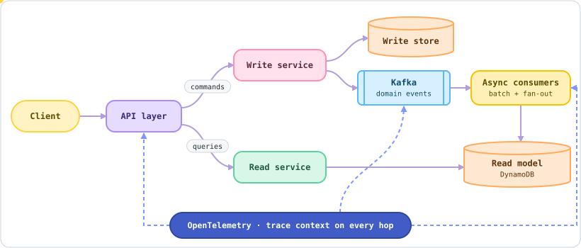
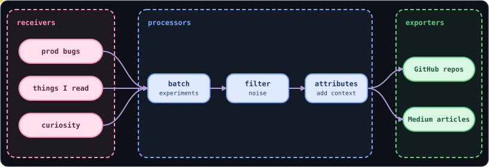

  

<h1 align="center">Hi, I'm Sneha 👋</h1>

  

  <b>Senior Backend Engineer</b> · 5 years building distributed, event-driven systems on AWS 

---

### 🏗️ Building Backend

I build distributed, event-driven systems that scale to millions of users and stay observable from end to end.

  

---

### 📡 Pillars of my profile

  

| 🔭 Traces | 📈 Metrics | 📝 Logs |
|:--|:--|:--|
| [nodejs-enhanced-default-http-tracing](https://github.com/thisissneha/nodejs-enhanced-default-http-tracing) | [All repositories](https://github.com/thisissneha?tab=repositories) | [OTel default HTTP instrumentation](https://medium.com/@sneha_99/opentelemetry-unlocking-powerful-performance-insights-with-default-http-instrumentation-4fd14d5f3e46) · [Track Every Request](https://medium.com/@sneha_99/track-every-request-a-guide-to-opentelemetry-5f3cb312015c) |

#### 🧭 How my ideas flow through the collector

  

---

### 🏷️ Resource attributes

| Attribute | Value |
|:--|:--|
| `languages` |     |
| `runtime` |  |
| `cloud` |    |
| `streaming` |   |
| `observability` |   |
| `delivery` |   |

---

### 🔗 Export to

  

